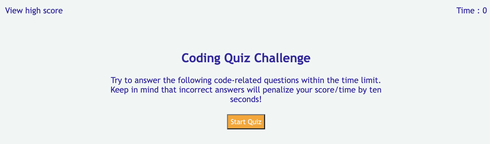
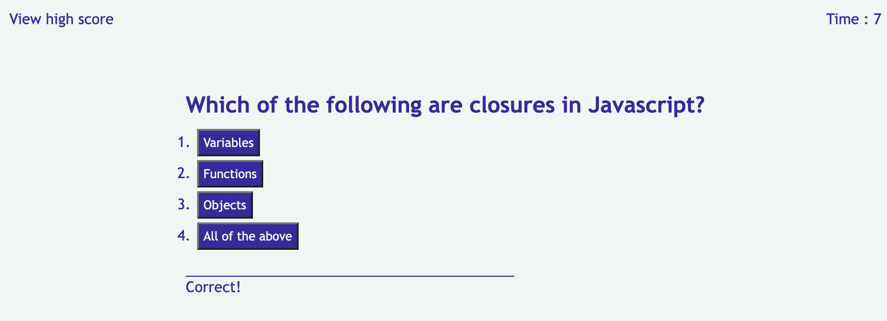
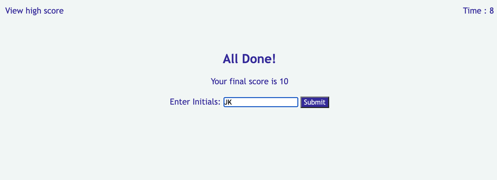
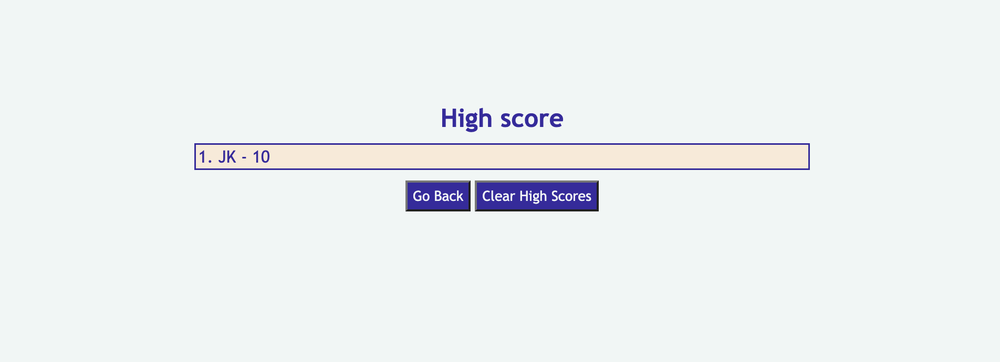

# 04-WebAPI-JS-Quiz
## Description
Quiz application created using Javascript, html and css. 

This application will present 5 question about Javascript from a list of 10 questions that are randomly selected. 

Answer them within 30 seconds otherwise application will take user to result page to show their current score. 
Enter the initial to save the scores to localstorage.

Result can be viewed using view high score navigation link.

Each correct answer will get 2 points and any incorrect answer will reduce 1 point and take 10 seconds off remaining timing. Maximum allowed score 10.

## Usage

Website has been deployed using GitHub pages and can be reached through below link,
https://chandraucb.github.io/04-WebAPI-JS-Quiz/

## Reference
JS questions and answers are referred from below link,
https://www.interviewbit.com/javascript-mcq/

